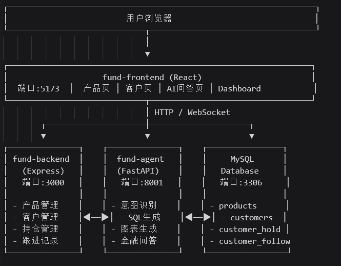

一. 需求分析

1.1 场景理解

本项目是一个基金销售管理系统，旨在帮助基金公司或销售团队管理产品、客户、持仓及跟进记录，并引入 AI 能力实现智能化辅助。

我理解的核心需求是： <br>
1、基础业务管理：产品、客户、持仓、跟进记录的增删改查 <br>
2、AI智能问答：通过自然语言查询数据库，生成图表，解答金融问题 <br>
3、可视化展示：前端页面展示数据及图表 <br>

1.2 已实现的功能  ---> 为所用技术栈

 （1）产品管理 : 增删改查 ---> Express API + MySQL <br>
 （2）客户管理 : 增删改查 ---> Express API + MySQL <br>
 （3）持仓管理 : 增删改查 ---> Express API + MySQL <br>
 （4）跟进记录 : 增删改查 ---> Express API + MySQL <br>
 （5）AI 问答 : 自然语言转SQL ---> Python + LangChain + 通义千问 <br>
 （6）图表生成 : 饼图/柱状图/折线图 ---> LLM意图识别 + Recharts <br>
 （7）金融知识问答 : 非数据库问题解答 ---> LLM 流式输出  <br>

1.3 选型理由

- AI Agent：采用 LangChain 框架配合通义千问，是因为项目时间有限，需要快速集成且 API 稳定性好
- 前后端分离：标准现代化架构，便于分工协作
- Ant Design：企业级 UI 组件库，开发效率高
- Recharts：React 生态中成熟的图表库

1.4 未完成的功能（时间有限）

1. 用户认证与权限管理 - 未实现登录注册、角色权限控制
2. 数据导出功能 - Excel/CSV 导出
3. 移动端适配 - 仅支持桌面端

1.5 如再给2天会优先做什么

（1）用户登录系统 - 添加 JWT 登录验证，保证数据安全
（2）Prompt提示词优化 - 目前系统的AI智能助手还不够智能，需要不断的优化prompt提高智能度

---

二. 技术选型

2.1 技术方案
    AI 框架 : LangChain <br>
    LLM : 通义千问 (Qwen Turbo) <br>
    后端 API : Express.js <br>
    数据库 : MySQL8 <br>
    前端框架 : React19 <br>
    前端构建 : Vite  <br>
    UI库 : Ant Design <br>
    图表库 : Recharts  <br>
    语言 : TypeScript <br>

2.2 选型理由

为什么用 LangChain
👉 LangChain 提供了成熟的 Chain 抽象，SQL 生成、意图识别流程化

为什么用Node.js + Express
👉 项目前端已是 Node 生态，保持技术栈统一;Express 轻量灵活，适合中小型 CRUD 项目

为什么用 React 19 + Ant Design
👉 React 19 是最新版本，性能有提升;Ant Design 是企业级组件库，表格、表单、弹窗组件完善

2.3 架构图
<!-- ┌─────────────────────────────────────────────────────────────────┐
│                         用户浏览器                              │
└─────────────────────────────┬───────────────────────────────────┘
                              │
                              ▼
┌────────────────────────────────────────────────────────────────┐
│                    fund-frontend (React)                       │
│  端口:5173  │  产品页 │ 客户页 │ AI问答页 │ Dashboard           │
└─────────────────────────────┬──────────────────────────────────┘
                              │ HTTP / WebSocket
        ┌─────────────────────┼─────────────────────┐
        ▼                     ▼                     ▼
┌───────────────┐    ┌───────────────┐    ┌────────────────┐
│ fund-backend  │    │  fund-agent   │    │     MySQL      │
│   (Express)   │    │  (FastAPI)    │    │   Database     │
│   端口:3000   │    │   端口:8001   │    │   端口:3306     │
│               │    │               │    │                │
│ - 产品管理    │    │ - 意图识别    │    │ - products      │
│ - 客户管理    │◀──▶│ - SQL生成    │◀──▶│ - customers  │
│ - 持仓管理    │    │ - 图表生成    │    │ - customer_hold │
│ - 跟进记录    │    │ - 金融问答    │    │ - customer_follow
└───────────────┘    └───────────────┘    └─────────────────┘ -->



三. AI 协作日志

3.1 AI 使用环节


1、代码生成：生成基础 CRUD 模板代码，通用代码生成。 <br>
2、SQL 生成：将自然语言转为 SQL 查询。 <br>
3、意图识别：判断是否需要生成图表。 <br>
4、回答生成：将查询结果转为自然语言。 <br>

3.2 典型 Prompt → AI 输出 → 采纳情况

示例1：SQL生成提示词

**Prompt:**
```
你是一个基金数据查询助手，根据用户问题生成可执行的 MySQL SQL。
数据库表：
1. products(产品表) id,product_name,product_type,latest_nav,establish_scale,product_status,create_time
2. customers(客户表) id,customer_name,phone,company,customer_status,create_time
...

只返回SQL，不要解释，不要多余内容。
用户问题：帮我查一下债券型基金有哪些
SQL：
```

**AI 输出:**
```sql
SELECT product_name FROM products WHERE product_type='债券型'
```

**我的处理:**
- ✅ **完全采纳**：直接执行该 SQL，查询结果返回给用户
- 这类简单查询 LLM 表现稳定，直接使用


示例2：添加产品功能（未采纳）

**Prompt:**
```
用户问题：帮我添加一个产品，名称是"测试基金"，类型是"股票型"，净值1.5
请解析出产品信息并生成 INSERT 语句
```

**AI 输出:**
```sql
INSERT INTO products (product_name, product_type, latest_nav, ...) VALUES (...)
```

**我的处理:**
- ❌ **放弃采纳**：AI 生成的 SQL 可能有注入风险
- **改为**：使用正则表达式手动解析关键字段，确保安全

四. 自我复盘

4.1 已知的待修复问题

1. 无登录验证 <br>
2. AI 回复不稳定，同一问题多次提问，回复可能不同 <br>
3. SQL 注入风险 <br>
4. 无请求限流，AI 接口可能被恶意调用 <br>


4.2 真实企业项目的差异化决策;如果这是真实的企业项目，我会做以下调整：

1.技术栈选择
   -后端用 Java Spring Boot 替代 Express（企业级稳定性） 
   - 数据库选型考虑读写分离、分库分表 
   - 引入 Redis 缓存热点数据

2.安全合规
   - 全链路 HTTPS
   - JWT + RBAC 权限控制
   - SQL 白名单机制，禁止 LLM 直接执行生成式 SQL
   - 敏感操作日志审计

3.AI改进
   - 使用 RAG 接入企业内部知识库
   - 多模型ensemble，提升回复准确性
   - 对话上下文持久化，支持多轮对话
